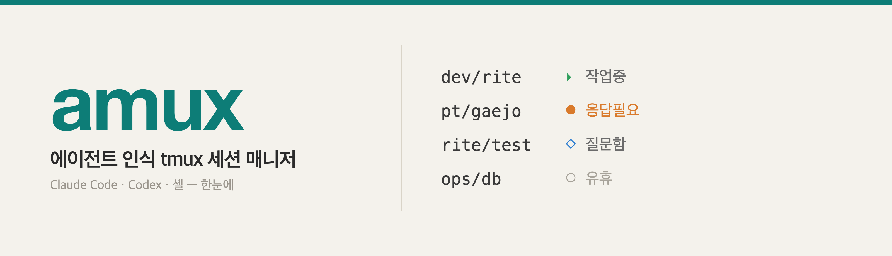

<p align="center">
  
</p>

# amux

[English](README.md) · **한국어**

**에이전트 인식 tmux 세션 매니저.** 모든 tmux 세션을 한눈에 — 무엇을 실행 중인지
(Claude Code / Codex / 셸), 그리고 *작업중*인지 *내 응답을 기다리는지* *유휴*인지를
라이브 fzf 피커(실제 화면 미리보기 포함)와 풀스크린 대시보드로 보여줍니다.

여러 AI 코딩 에이전트 세션을 동시에 굴릴 때(특히 원격/헤드리스 서버) 쓰려고 만들었습니다.
순수 Bash + tmux. macOS(bash 3.2)·Linux 모두 동작.


```
 ⬢ tmux 세션   8개 세션
▸ 2 작업중    ◆ 1 응답 필요    ◇ 2 질문함    ✎ 1 입력중    ● 2 대기    ○ 0 유휴
⚠ 주목  api/server  web/ui
────────────────────────────────────────────────────────────────────────────
   api      (2)
    ◆  응답 필요   3m     server
    ▸  작업중      now    worker
   web      (1)
    ◇  질문함      12m    ui
   infra    (1)
    ○  유휴        5d     logs
```

## 왜 만들었나

Claude Code / Codex 세션을 tmux로 여러 개 띄우면, 어떤 게 바쁜지 · 어떤 게 조용히
내 답을 기다리는지 · 어떤 걸 며칠째 방치했는지 구분이 안 됩니다. `amux`는 각 세션의
실제 화면을 읽어 상태를 붙여줍니다:

| 상태 | 의미 |
|------|------|
| ▸ **작업중** | 에이전트가 생성/실행 중 |
| ◆ **응답 필요** | 권한·선택 박스가 떠서 내가 답할 때까지 막혀 있음 |
| ◇ **질문함** | 마지막 메시지가 질문이고 프롬프트에서 대기 중 |
| ✎ **입력중** | 입력칸에 작성하던 초안이 남아 있음 |
| ● **대기** | 조용히 입력 대기 |
| ○ **유휴** | 대기 + N일(기본 3) 동안 활동 없음 |

세션 이름은 `태그/이름` 형식(예: `api/server`)이고 태그별로 고유 색상 칩으로 묶입니다.
내 응답이 필요한 세션은 피커 맨 위로 떠오릅니다.

## 요구 사항

- **tmux** (필수)
- **fzf** ≥ 0.38 (권장 — 라이브 피커·미리보기 동작. 없으면 번호 메뉴로 폴백)
- **curl** (권장 — 피커 미리보기 자동 갱신)

## 설치

```sh
git clone https://github.com/DevMinGeonPark/amux.git
cd amux
./install.sh          # ~/.local/bin 에 설치, 셸 연동 옵션 제안
```

또는 `bin/amux`를 `PATH` 어딘가에 두기만 해도 됩니다.

## 사용법

```sh
amux                 # 전체 세션 목록 (그룹 + 상태)
amux pick    # -p    # 실제 화면 미리보기가 있는 라이브 fzf 피커
amux watch   # -w    # 풀스크린 대시보드 (자동 갱신)
amux attach api      # 짧은 이름으로 접속 (<태그>/api 매칭)
amux --help
```

### 피커 단축키

| 키 | 동작 |
|----|------|
| `⏎` | 선택 세션 접속 |
| `^n` | 새 세션 (태그 · 이름 · 도구 · 폴더 입력) |
| `^t` | 선택 세션 태그 변경 |
| `^x` | 선택 세션 종료(kill) |
| `^r` | 목록 새로고침 |

오른쪽 칸에 강조된 세션의 **실제 화면**이 떠서 스스로 갱신되므로, 접속하지 않고도
에이전트를 지켜볼 수 있습니다. 좁은 터미널에서는 미리보기가 자동으로 아래에 붙습니다.

### 추천 별칭

```sh
alias a='amux attach'    # a api  → <태그>/api 접속
alias aw='amux watch'
```

## 설정

전부 환경변수로:

| 변수 | 기본값 | 의미 |
|------|--------|------|
| `AMUX_LANG` | 자동(로케일) | UI 언어: `en` 또는 `ko` |
| `AMUX_DORMANT_DAYS` | `3` | N일 무활동 시 대기 → 유휴 |
| `AMUX_WATCH_INTERVAL` | `2` | 대시보드 갱신 주기(초) |
| `AMUX_PICK_INTERVAL` | `2` | 피커 미리보기 갱신 주기(초) |
| `AMUX_DIR_ROOTS` | `$HOME` | 폴더 브라우저 시작 위치(`:` 구분 중 첫 항목) |
| `AMUX_CLAUDE_CMD` | `claude --dangerously-skip-permissions` | 새 **claude** 세션에서 실행할 명령 |
| `AMUX_CODEX_CMD` | `codex --dangerously-bypass-approvals-and-sandbox` | 새 **codex** 세션에서 실행할 명령 |

새 에이전트 세션은 기본적으로 무인("yolo") 모드로 실행되어 권한·승인 프롬프트에서
멈추지 않습니다. 일반 대화 모드로 쓰려면 예: `AMUX_CLAUDE_CMD='claude'` 로 설정하세요.

상태 감지 정규식은 `bin/amux` 상단(`RE_BLOCK`, `RE_ASK`)에 있습니다 — 에이전트
프롬프트가 다르면 여기서 조정하세요.

## 동작 원리

각 세션마다 포그라운드 프로그램(셸의 자식 프로세스)을 찾아 도구를 식별한 뒤 화면을 읽습니다:

- 터미널 타이틀의 스피너로 *작업중* vs *대기* 판별;
- 화면 하단에서 권한/선택 박스(*응답 필요*)나 입력칸의 초안(*입력중*) 탐지;
- 마지막 메시지에서 질문 여부 탐지(*질문함*);
- tmux의 `session_activity` 타임스탬프로 *유휴* 판단.

세션별 작업이 병렬로 돌아 세션이 많아도 빠릅니다. 렌더링은 순수 Bash(외부 폭 계산
도구 없이 CJK 대응)이고 터미널 크기에 반응형입니다.

## 참고

- `amux`는 tmux/프로세스 상태와 화면 내용만 읽습니다. 어디로도 데이터를 보내지 않습니다.
- `claude`, `codex`를 프로세스 이름으로 인식하며, 그 외 포그라운드 프로그램은 이름 그대로 표시합니다.

## 라이선스

MIT — [LICENSE](LICENSE) 참고.
