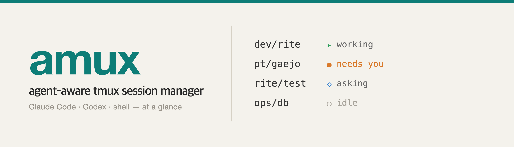

<p align="center">
  
</p>

# amux

**English** · [한국어](README.ko.md)

**Agent-aware tmux session manager.** See every tmux session at a glance —
what it's running (Claude Code / Codex / shell), and whether it's *working*,
*waiting for you*, or has gone *idle* — with a live fzf picker, a real-screen
preview, and a full-screen dashboard.

Built for juggling many AI coding-agent sessions at once (especially on a
remote/headless box). Pure Bash + tmux; works on macOS (bash 3.2) and Linux.


```
 ⬢ tmux sessions   8 sessions
▸ 2 working    ◆ 1 needs you    ◇ 2 asking    ✎ 1 typing    ● 2 idle    ○ 0 dormant
⚠ attention  api/server  web/ui
────────────────────────────────────────────────────────────────────────────
   api      (2)
    ◆  needs you   3m     server
    ▸  working     now    worker
   web      (1)
    ◇  asking      12m    ui
   infra    (1)
    ○  dormant     5d     logs
```

## Why

When you run several Claude Code / Codex sessions in tmux, you can't tell which
ones are busy, which are quietly waiting for your answer, and which you forgot
about days ago. `amux` reads each session's live screen and labels it:

| state | meaning |
|-------|---------|
| ▸ **working**   | the agent is generating / running |
| ◆ **needs you** | a permission or choice box is up — blocked until you answer |
| ◇ **asking**    | the agent's last message is a question, waiting at the prompt |
| ✎ **typing**    | you left a draft in the input box |
| ● **idle**      | quietly waiting for input |
| ○ **dormant**   | idle with no activity for N days (default 3) |

Sessions are named `tag/name` (e.g. `api/server`) and grouped by tag with a
distinct color chip. Sessions that need you float to the top of the picker.

## Requirements

- **tmux** (required)
- **fzf** ≥ 0.38 (recommended — powers the live picker & preview; falls back to a plain numbered menu)
- **curl** (recommended — auto-refreshes the picker preview)

## Install

```sh
git clone https://github.com/DevMinGeonPark/amux.git
cd amux
./install.sh          # installs to ~/.local/bin, offers shell integration
```

`install.sh` copies the binary, then (if you say yes) adds a small managed
block to your shell rc that puts `~/.local/bin` on `PATH` and enables
tab-completion. It also asks whether to **auto-open the picker on SSH logins**
(handy on a remote/headless box) — answer `y` to enable it. Re-running the
installer is safe; the block is updated in place, not duplicated.

Or just put `bin/amux` anywhere on your `PATH` and skip the shell integration.

## Usage

```sh
amux                 # list all sessions (grouped, with status)
amux pick    # -p    # live fzf picker with a real-screen preview
amux watch   # -w    # full-screen dashboard (auto-refreshing)
amux attach api      # attach by short name (matches <tag>/api)
amux --help
```

### Picker keys

| key | action |
|-----|--------|
| `⏎` | attach the selected session |
| `^n` | new session (asks tag · name · tool · folder) |
| `^t` | retag the selected session |
| `^x` | kill the selected session |
| `^r` | reload the list |

The right pane shows the **live screen** of the highlighted session and
refreshes on its own, so you can watch an agent without attaching. On narrow
terminals the preview stacks below the list automatically.

### Suggested aliases

```sh
alias a='amux attach'    # a api  → attach <tag>/api
alias aw='amux watch'
```

## Configuration

All via environment variables:

| variable | default | meaning |
|----------|---------|---------|
| `AMUX_LANG` | auto (from locale) | UI language: `en` or `ko` |
| `AMUX_DORMANT_DAYS` | `3` | idle → dormant after N days of no output |
| `AMUX_WATCH_INTERVAL` | `2` | dashboard refresh interval (seconds) |
| `AMUX_PICK_INTERVAL` | `2` | picker preview refresh interval (seconds) |
| `AMUX_DIR_ROOTS` | `$HOME` | where the folder browser starts (first `:`-separated entry) |
| `AMUX_CLAUDE_CMD` | `claude --dangerously-skip-permissions` | command run for a new **claude** session |
| `AMUX_CODEX_CMD` | `codex --dangerously-bypass-approvals-and-sandbox` | command run for a new **codex** session |

New agent sessions launch in unattended ("yolo") mode by default, so they run
without pausing for permission/approval prompts. To use the normal interactive
mode instead, set e.g. `AMUX_CLAUDE_CMD='claude'`.

The status-detection regexes live at the top of `bin/amux` (`RE_BLOCK`,
`RE_ASK`) — tweak them if your agent's prompts differ.

## How it works

For each session, `amux` finds the foreground program (the shell's child
process) to identify the tool, then reads the pane:

- the terminal-title spinner tells *working* vs *idle*;
- the bottom of the screen is scanned for a permission/choice box (*needs you*)
  or a draft in the input line (*typing*);
- the last message is scanned for a question (*asking*);
- tmux's `session_activity` timestamp drives *dormant*.

Per-session work runs in parallel, so listing stays fast even with many
sessions. Rendering is pure Bash (no external width tools), CJK-aware, and
responsive to terminal size.

## Notes

- `amux` only reads tmux/process state and pane contents; it sends no data
  anywhere.
- It looks for `claude` and `codex` by process name; any other foreground
  program is shown by its own name.

## License

MIT — see [LICENSE](LICENSE).
